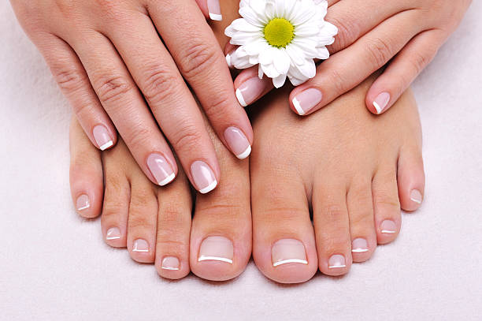

<!DOCTYPE html>
<html lang="pt-BR">
<head>
    <meta charset="UTF-8">
    <meta name="viewport" content="width=device-width, initial-scale=1.0">
    <title>Salão de Beleza</title>
    
</head>
<body>

<header>
    <h1>Salão da Cleorice</h1>
    <nav>
        <a href="#servicos">Serviços</a>
        <a href="#agendamento">Agendamentos</a>
    </nav>
</header>

    <section id="servicos">
        <h2>Serviços</h2>
        

            
            

                <h3>Corte de Cabelo</h3>
                
R$ 50,00

            

        

        

            
            

                <h3>Tintura de Cabelo</h3>
                
R$ 120,00

            

        

        

            
            

                <h3>Manicure</h3>
                
R$ 30,00

            

        

    </section>

    <section id="agendamento">
        <section id="agendamento">
            <h2>Agendamentos</h2>
            <form id="form-agendamento">
                <label for="nome">Nome:</label>
                <input type="text" id="nome" name="nome" required>  
                
                <label for="servico">Serviço:</label>
                <select id="servico" name="servico" required>
                    <option value="" disabled selected>Selecione um serviço</option>
                    <option value="Corte de Cabelo">Corte de Cabelo</option>
                    <option value="Tintura de Cabelo">Tintura de Cabelo</option>
                    <option value="Manicure">Manicure</option>
                </select>  
                
                <label for="data">Data:</label>
                <input type="date" id="data" name="data" required>  
                
                <label for="horario">Horário:</label>
                <input type="time" id="horario" name="horario" required>  
                
                <button type="button" onclick="enviarWhatsApp()">Agendar</button>
            </form>
        </section>
        

<footer>
    
&copy; 2025 Salão de Beleza. Todos os direitos reservados.

</footer>

</body>
</html>
